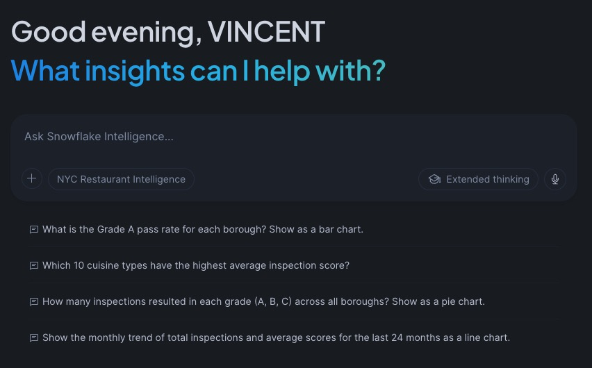

<div align="center">
  

  # NYC Restaurant Intelligence — Agentic BI on Snowflake
</div>

[](https://opensource.org/licenses/MIT)
[](https://www.snowflake.com/)
[](https://www.getdbt.com/)
[](https://www.python.org/)
[](https://docs.snowflake.com/en/user-guide/snowflake-cortex/cortex-agents)

> A fully reproducible agentic BI application built on Snowflake, using NYC restaurant inspection open data. Demonstrates how progressive context loading — structured semantic layer, unstructured document retrieval, persistent user memory, and a Cortex Agent orchestrating all three — closes the gap between raw data and genuinely useful AI answers. Every phase ships with working code, honest failure documentation, and a cloneable repository.

## 🎯 What This Project Delivers

**v1.0:** End-to-end agentic BI on a free Snowflake trial — from open data ingestion to a conversational agent that combines live inspection data with NYC Health Code PDFs in a single answer.

- ✅ **Reproducible ingestion** — Socrata API → Snowflake RAW → dbt star schema in under two minutes
- ✅ **Production-grade data quality** — five undocumented source issues found, documented, and resolved in the staging layer
- ✅ **Semantic layer** — 1,365-line Snowflake Semantic View encoding domain knowledge: score directionality, grade logic, borough filters, verified queries
- ✅ **Cortex Analyst** — natural language to SQL over governed semantic definitions
- ✅ **Cortex Search** — NYC Health Code PDFs (Article 81, Chapter 23) indexed and queryable by the agent
- ✅ **Cortex Agent** — orchestrates both tools; answers "which restaurants have the most critical violations, and what does the health code say about closure thresholds?" in one response
- ✅ **Python REST client** — JWT key-pair auth, SSE streaming, client-side SQL execution loop, debug mode, multi-turn sessions
- ✅ **Production readiness** — cost monitoring via `ACCOUNT_USAGE`, MFA enforcement, audit trail

**v1.1:** Persistent memory and interactive map — the agent now remembers who you are across sessions, and inspection grades are visualised on a live map.

- ✅ **Client-side memory (Phase 5)** — `AGENT_USER_MEMORY` table, regex-based fact extraction, context injection. Two deployment targets: CLI (`agent_with_memory.py`) and Streamlit in Snowflake (`streamlit_app.py`)
- ✅ **Native agent memory (Phase 6)** — server-side memory using Cortex Agent custom tools (`store_user_memory`, `retrieve_user_memories`), `AI_EMBED` vector embeddings, `VECTOR_COSINE_SIMILARITY` retrieval — no client code required
- ✅ **Cross-session persistence** — facts stored in one session are retrieved in future sessions without re-asking
- ✅ **Emergent soft-delete** — "forget my address" works without a dedicated delete tool; agent uses the store procedure to write a `REMOVE` sentinel, confirmed through 62-question structured test suite
- ✅ **Interactive map** — pydeck map in Streamlit in Snowflake, querying directly through the semantic view for consistency with agent answers

**Processing open data:** NYC DOHMH inspection records (296k rows, updated daily) + Health Code PDFs → governed star schema → semantic layer → Cortex Agent with persistent memory → conversational interface.



**Article series:** [LinkedIn — Vincent Vikor](https://www.linkedin.com/in/vincent-vikor-8662984/)
**Dataset:** [NYC Restaurant Inspection Results](https://data.cityofnewyork.us/Health/NYC-Restaurant-Inspection-Results/gv23-aida/about_data) — NYC Open Data, updated daily by NYC DOHMH

---

## Architecture

```
Socrata API (NYC Open Data)
        │
        │  HTTP/JSON, paginated (10k rows/request)
        ▼
ingestion/load_inspections.py
        │
        │  snowflake-connector-python, TRUNCATE + bulk INSERT
        ▼
RESTAURANT_INTELLIGENCE.RAW.INSPECTIONS_RAW
        │
        │  dbt Core transformations
        ▼
RESTAURANT_INTELLIGENCE.STAGING
  ├── stg_inspections      ← Typed, cleaned, deduped
  ├── stg_restaurants      ← One row per restaurant (CAMIS)
  └── stg_violations       ← Violation code reference

        │
        │  dbt MARTS models
        ▼
RESTAURANT_INTELLIGENCE.MARTS
  ├── dim_restaurant        ← Restaurant dimension
  ├── dim_violation_type    ← Violation reference dimension
  ├── dim_date              ← Date spine (required for time intelligence)
  ├── fct_inspections       ← Inspection events (aggregated)
  └── fct_violations        ← Individual violations cited (granular)

        │
        │  Snowflake Semantic View (1,365-line YAML)
        ▼
MARTS.NYC_RESTAURANT_INSPECTIONS
  ├── Logical tables, dimensions, metrics
  ├── Business rules: score directionality, borough exclusion, time defaults
  └── Verified queries for common patterns

        │
        │  Cortex Search (PDF index)
NYC Health Code PDFs (Article 81, Chapter 23)
  └── ingestion/table_aware_extraction.py → MARTS.DOCUMENT_CHUNKS
                                          → MARTS.HEALTH_CODE_SEARCH

        │
        │  Orchestration
        ▼
MARTS.NYC_RESTAURANT_AGENT (Cortex Agent)
  ├── Tool: Cortex Analyst ← structured queries via semantic view
  └── Tool: Cortex Search  ← regulatory document retrieval

        │
        ├── Snowsight UI            ← conversational interface (no dev hooks)
        └── cortex/cortex_agent.py  ← Python REST API (JWT auth, SSE streaming, multi-turn)

        │
        ▼
monitoring/
  ├── CORTEX_ANALYST_USAGE_HISTORY       ← per-message cost
  ├── CORTEX_SEARCH_DAILY_USAGE_HISTORY  ← serving + embedding cost
  └── METERING_DAILY_HISTORY             ← invoice-aligned rollup

        │
        ▼  Phase 5 — Client-side memory
memory/
  ├── AGENT_USER_MEMORY (key-value table)
  ├── memory_manager.py    ← regex fact extraction, context injection, MERGE upsert
  ├── agent_with_memory.py ← CLI client with memory
  └── streamlit_app.py     ← Streamlit in Snowflake app

        │
        ▼  Phase 6 — Native agent memory
native_memory/
  ├── AGENT_MEMORY_VECTORS (key-value + VECTOR(FLOAT,1024) embeddings)
  ├── STORE_USER_MEMORY    ← stored procedure: AI_EMBED + MERGE
  ├── RETRIEVE_USER_MEMORIES ← stored procedure: AI_EMBED + VECTOR_COSINE_SIMILARITY
  └── NYC_RESTAURANT_MEMORY_AGENT ← Cortex Agent with custom memory tools

        │
        ▼  Map
map/
  └── streamlit_map_app.py ← pydeck map via SEMANTIC_VIEW (same governed layer as agent)
```

**Load strategy:** Full TRUNCATE + reload on every pipeline run. No incremental logic — keeps the demo simple and idempotent. Typical full load timing: ~110s fetching from Socrata (network-bound) + ~17s loading to Snowflake via internal stage = ~127s total.

---

## Prerequisites

| Tool | Version | Purpose |
|------|---------|---------|
| Python | ≥ 3.11 | Ingestion script |
| dbt Core | ≥ 1.8 | SQL transformations |
| Snowflake account | Trial or paid | Target data platform |

A free [Snowflake trial account](https://signup.snowflake.com/) (30 days / $400 credits) covers Phases 1–4. **Trial accounts without a valid payment method are limited to approximately 10 Cortex AI credits per day** — this cap applies to Cortex Agent, Cortex Analyst, and Cortex Search calls. Heavy testing across all phases in a single day can hit this limit. Adding a payment method removes the cap and converts the account to paid. See [Snowflake trial account limits](https://docs.snowflake.com/en/user-guide/admin-trial-account#using-compute-resources) for details. Phases 5–6 also require a paid account for the Cortex Agent REST API and custom agent tools (noted in each phase's README).

---

## Setup — Step by Step

### Step 1 — Clone the repository

```bash
git clone https://github.com/vincevv017/nyc-restaurant-intelligence.git
cd nyc-restaurant-intelligence
```

### Step 2 — Create your environment file

```bash
cp .env.example .env
```

Edit `.env` with your Snowflake credentials:

```dotenv
SNOWFLAKE_ACCOUNT=ORGNAME-ACCOUNTNAME
SNOWFLAKE_USER=your_username
SNOWFLAKE_WAREHOUSE=RESTAURANT_WH
SNOWFLAKE_DATABASE=RESTAURANT_INTELLIGENCE
SNOWFLAKE_ROLE=RESTAURANT_LOADER
NYC_APP_TOKEN=your_app_token
SNOWFLAKE_PRIVATE_KEY_PATH=~/.ssh/snowflake_rsa_key.pem
```

> **No password in `.env`** — `cortex_agent.py` and `memory_manager.py` both use key-pair auth (`SNOWFLAKE_PRIVATE_KEY_PATH`). Password auth triggers MFA on accounts where it is enforced (all paid accounts). dbt uses a separate `~/.dbt/profiles.yml` — see Step 8.


**Getting a free NYC Open Data app token:**  
Register at [data.cityofnewyork.us](https://data.cityofnewyork.us) → Developer Settings → Create New App Token. Without a token, requests are rate-limited to 1,000 rows/request instead of 1,000,000.

### Step 3 — Run the Snowflake setup script

Open a Snowflake worksheet logged in as **ACCOUNTADMIN**, paste and run `setup/01_snowflake_setup.sql`.

Before running, replace `YOUR_USERNAME` on the last line with your actual Snowflake username.

This creates:
- `RESTAURANT_WH` — XS warehouse, auto-suspends after 60s
- `RESTAURANT_INTELLIGENCE` database with RAW / STAGING / MARTS schemas
- `RESTAURANT_LOADER` role with all required permissions including `CREATE SCHEMA`
- `RAW.INSPECTIONS_RAW` table

### Step 4 — Install Python ingestion dependencies

The ingestion script gets its own virtual environment, kept separate from dbt to avoid dependency conflicts.

```bash
cd ingestion
python -m venv .venv
source .venv/bin/activate          # Windows: .venv\Scripts\activate
pip install -r requirements.txt
```

### Step 5 — Validate ingestion with a test load

```bash
python load_inspections.py --limit 1000
```

Expected output:
```
NYC Restaurant Intelligence — Data Loader
Started: 2026-03-01 08:47:43 UTC  |  Row limit: 1,000

✅ Fetched 1,000 total records from Socrata
✅ Inserted 1,000 rows into RESTAURANT_INTELLIGENCE.RAW.INSPECTIONS_RAW
   Row count confirmed: 1,000
🏁 Pipeline complete in 4.5s
```

### Step 6 — Run the full load

```bash
python load_inspections.py
```

Fetches the complete dataset (~296k rows). Expect ~2 minutes total (~110s Socrata fetch + ~17s Snowflake load).

### Step 7 — Set up dbt

dbt gets its own virtual environment at the **project root** — separate from the ingestion venv.

```bash
cd ..                              # back to project root
python -m venv .venv-dbt
source .venv-dbt/bin/activate      # Windows: .venv-dbt\Scripts\activate
pip install dbt-snowflake
dbt --version                      # verify: shows dbt-core and dbt-snowflake
```

### Step 8 — Configure the dbt profile

dbt credentials live in your home directory, never inside the project.

```bash
mkdir -p ~/.dbt
cp dbt/profiles.yml.example ~/.dbt/profiles.yml
nano ~/.dbt/profiles.yml           # fill in your credentials
```

```yaml
nyc_restaurant_intelligence:
  target: dev
  outputs:
    dev:
      type:      snowflake
      account:   ORGNAME-ACCOUNTNAME   # same format as your .env
      user:      your_username
      password:  your_password
      role:      RESTAURANT_LOADER
      database:  RESTAURANT_INTELLIGENCE
      warehouse: RESTAURANT_WH
      schema:    STAGING
      threads:   4
```

### Step 9 — Validate the dbt connection

```bash
cd dbt
dbt debug
```

All checks must pass before proceeding:
```
profiles.yml file   [OK found and valid]
dbt_project.yml     [OK found and valid]
Connection test:    [OK connection ok]
All checks passed!
```

### Step 10 — Run dbt transformations

```bash
dbt run
```

Expected — 8 models in ~3 seconds:
```
Found 8 models, 1 source, 523 macros
Concurrency: 4 threads

1 of 8 START sql table model MARTS.dim_date .................. [RUN]
2 of 8 START sql view model STAGING.stg_inspections .......... [RUN]
...
Done. PASS=8 WARN=0 ERROR=0 SKIP=0 TOTAL=8
```

### Step 11 — Verify in Snowflake

```sql
SELECT 'RAW'             AS layer, COUNT(*) AS row_count FROM RESTAURANT_INTELLIGENCE.RAW.INSPECTIONS_RAW
UNION ALL
SELECT 'STG_INSPECTIONS',          COUNT(*) FROM RESTAURANT_INTELLIGENCE.STAGING.STG_INSPECTIONS
UNION ALL
SELECT 'DIM_RESTAURANT',           COUNT(*) FROM RESTAURANT_INTELLIGENCE.MARTS.DIM_RESTAURANT
UNION ALL
SELECT 'FCT_INSPECTIONS',          COUNT(*) FROM RESTAURANT_INTELLIGENCE.MARTS.FCT_INSPECTIONS
UNION ALL
SELECT 'FCT_VIOLATIONS',           COUNT(*) FROM RESTAURANT_INTELLIGENCE.MARTS.FCT_VIOLATIONS;
```

---

## Pipeline Commands Reference

```bash
# ── Ingestion (from ingestion/ with ingestion venv active) ───────────────────
python load_inspections.py                  # Full load (~250k rows)
python load_inspections.py --limit 1000     # Test load
python load_inspections.py --dry-run        # Fetch only, no Snowflake writes

# ── dbt (from dbt/ with dbt venv active) ────────────────────────────────────
dbt debug                                   # Validate connection first
dbt run                                     # Build all models
dbt run --select staging                    # Staging layer only
dbt run --select marts                      # Marts layer only
dbt test                                    # Run data quality tests
dbt docs generate && dbt docs serve         # Interactive lineage documentation
```

---

## Data Model Reference

### Fact Tables

| Table | Grain | Key Measures |
|-------|-------|-------------|
| `fct_inspections` | 1 row per restaurant × inspection date × inspection type | `inspection_score`, `total_violations`, `critical_violations` |
| `fct_violations`  | 1 row per violation cited per inspection | `violation_count` (always 1, additive) |

### Dimension Tables

| Table | Grain | Notes |
|-------|-------|-------|
| `dim_restaurant`     | 1 row per CAMIS | Latest known name, address, cuisine |
| `dim_violation_type` | 1 row per violation code | Critical flag, description |
| `dim_date`           | 1 row per calendar day | 2000-01-01 to 2030-12-31. Mandatory for Snowflake Intelligence time-intelligence queries |

### Grading Logic (NYC DOHMH)

| Grade | Score Range | Meaning |
|-------|-------------|---------|
| A | 0–13 | Passes — minimal violations |
| B | 14–27 | Passes — significant violations |
| C | 28+ | Fails — conditional operating permit |
| Z | — | Grade pending (re-inspection scheduled) |
| P | — | Pre-permit (new establishment) |

Higher score = more violations = worse outcome.

---

## Repository Structure

```
nyc-restaurant-intelligence/
├── .env.example                          ← Credential template (copy to .env)
├── .gitignore
├── pyrightconfig.json
├── README.md                             ← You are here (Phase 1)
│
├── setup/
│   ├── 01_snowflake_setup.sql            ← Run once as ACCOUNTADMIN
│   └── config.py                         ← Reads from .env
│
├── ingestion/                            ← Phase 1: Socrata → RAW → star schema
│   ├── .venv/                            ← Ingestion venv (gitignored)
│   ├── requirements.txt
│   └── load_inspections.py               ← Socrata → Snowflake loader
│
├── .venv-dbt/                            ← dbt venv (gitignored)
│
├── dbt/                                  ← Phase 1: transformations
│   ├── dbt_project.yml
│   ├── profiles.yml.example              ← Copy to ~/.dbt/profiles.yml
│   ├── macros/
│   │   └── generate_schema_name.sql      ← Prevents STAGING_STAGING / MARTS_MARTS naming
│   └── models/
│       ├── staging/
│       │   ├── sources.yml
│       │   ├── stg_inspections.sql
│       │   ├── stg_restaurants.sql
│       │   └── stg_violations.sql
│       └── marts/
│           ├── dim_date.sql
│           ├── dim_restaurant.sql
│           ├── dim_violation_type.sql
│           ├── fct_inspections.sql
│           └── fct_violations.sql
│
├── semantic/                             ← Phase 2: semantic view + Cortex Analyst
│   ├── README.md
│   ├── 02_deploy_semantic.sql
│   └── nyc_restaurant_inspections.yaml   ← 1,365-line semantic view YAML
│
├── cortex/                               ← Phase 3: Cortex Search + Cortex Agent
│   ├── README.md
│   ├── .venv/                            ← Cortex venv (gitignored)
│   ├── requirements.txt
│   ├── load_documents.py                 ← Downloads PDFs → RAW.DOCUMENT_CHUNKS
│   ├── table_aware_extraction.py         ← PDF table → narrative prose converter
│   ├── 03_cortex_search_setup.sql
│   ├── 04_cortex_agent_setup.sql
│   └── cortex_agent.py                   ← Python REST API agent (JWT, SSE, multi-turn)
│
├── monitoring/                           ← Phase 4: observability + security
│   ├── README.md
│   └── monitoring_security.sql
│
├── memory/                               ← Phase 5: client-side persistent memory
│   ├── memory_README.md
│   ├── memory_manager.py                 ← Fact store: MERGE upsert, regex extraction, context injection
│   ├── response_parser.py                ← Extracts 📅 freshness + 🔍 filters from agent responses
│   ├── agent_with_memory.py              ← CLI client with memory (JWT auth)
│   ├── streamlit_app.py                  ← Streamlit in Snowflake app with memory + map
│   └── upload_to_stage.py                ← Deploys app files to Snowflake stage
│
├── native_memory/                        ← Phase 6: server-side native memory (custom agent tools)
│   ├── GUIDE.md
│   ├── 01_memory_vector_table.sql        ← AGENT_MEMORY_VECTORS with VECTOR(FLOAT,1024)
│   ├── 02_memory_procedures.sql          ← STORE_USER_MEMORY + RETRIEVE_USER_MEMORIES
│   ├── 03_agent_with_native_memory.sql   ← NYC_RESTAURANT_MEMORY_AGENT spec
│   ├── 04_testing_strategy.sql           ← 62-question structured test suite
│   ├── test_results.yaml                 ← Test results template
│   ├── test_results_iteration_01.yaml    ← Run 1 results (initial spec)
│   └── test_results_iteration_02.yaml   ← Run 2 results (after out-of-scope fix)
│
└── map/                                  ← Interactive inspection grade map
    ├── README.md
    └── streamlit_map_app.py              ← pydeck map via SEMANTIC_VIEW
```

---

## Phase Navigation

Each subfolder has its own README covering setup, expected outputs, known issues, and design decisions for that phase. Follow them in order — each phase builds on the previous one.

| Phase | Folder | What it covers |
|-------|--------|---------------|
| 1 | *(this README)* | Socrata ingestion, dbt star schema, data quality |
| 2 | [`semantic/`](semantic/README.md) | Semantic view deployment, Cortex Analyst benchmarking |
| 3 | [`cortex/`](cortex/README.md) | Health code PDF indexing, Cortex Agent, Python REST client |
| 4 | [`monitoring/`](monitoring/README.md) | Cost tracking, MFA enforcement, audit trail |
| 5 | [`memory/`](memory/memory_README.md) | Client-side persistent memory, Streamlit in Snowflake app |
| 6 | [`native_memory/`](native_memory/GUIDE.md) | Server-side native memory, AI_EMBED, vector retrieval, custom agent tools |
| Map | [`map/`](map/README.md) | Interactive pydeck inspection grade map |

---

## Release Notes

### v1.1 — Native Memory & Map (April 2026)

**Phase 5 — Client-side persistent memory** (`memory/`)
- `AGENT_USER_MEMORY` key-value table — stores user facts across sessions
- `memory_manager.py` — regex-based fact extraction from agent responses, MERGE upsert, context injection into every future turn
- `response_parser.py` — extracts structured `📅 Data through` and `🔍 Filters applied` metadata from agent responses
- `agent_with_memory.py` — CLI client integrating memory with the existing Cortex Agent
- `streamlit_app.py` — full Streamlit in Snowflake app: chat interface, memory sidebar, data freshness panel, filter transparency, debug panel

**Phase 6 — Native agent memory** (`native_memory/`)
- `AGENT_MEMORY_VECTORS` — key-value table with `VECTOR(FLOAT, 1024)` embeddings via `snowflake-arctic-embed-l-v2.0`
- `STORE_USER_MEMORY` stored procedure — embeds and upserts facts; used by agent as a custom tool
- `RETRIEVE_USER_MEMORIES` stored procedure — embeds query, returns top-k facts by `VECTOR_COSINE_SIMILARITY`
- `NYC_RESTAURANT_MEMORY_AGENT` — new Cortex Agent alongside the original; shares the same semantic view and Cortex Search service
- 62-question structured test suite across 5 categories; 2 iterations documented with full pass/fail results
- Emergent soft-delete: "forget my address" works via `REMOVE` sentinel — no dedicated delete procedure needed

**Map** (`map/`)
- Interactive pydeck map of inspection grades deployed as a Streamlit in Snowflake app
- Queries through `SEMANTIC_VIEW` — identical numbers to the agent for the same question

### v1.0 — Agentic BI baseline (March 2026)
- Phases 1–4: ingestion, dbt star schema, semantic layer, Cortex Agent, monitoring

---

## Troubleshooting

**`EnvironmentError: Missing required environment variable: SNOWFLAKE_ACCOUNT`**  
→ `.env` is missing or not in the project root. Run `ls -la` at the root to verify.

**`404 Not Found` on connection**  
→ Wrong account identifier format. Use the `ORGNAME-ACCOUNTNAME` format — find it in Snowsight under **Admin → Accounts**, or run `SELECT CURRENT_ORGANIZATION_NAME() || '-' || CURRENT_ACCOUNT_NAME()`.

**`250001: Incorrect username or password`**  
→ Password is wrong or the role hasn't been granted to your user. Verify by logging into the Snowflake UI directly. Re-run the setup script if needed.

**`MFA authentication is required, but none of your current MFA methods are supported for programmatic authentication`**  
→ Your account enforces MFA for password-based connections (all paid accounts). `cortex_agent.py` and `memory_manager.py` use key-pair auth and are unaffected. For dbt, either enroll in MFA (Snowsight → your profile → MFA) or switch `~/.dbt/profiles.yml` to `authenticator: externalbrowser` for interactive sessions.

**`dbt_project.yml file [ERROR not found]`**  
→ Run `dbt debug` from inside the `dbt/` subfolder, not the project root.

**`Nothing to do` on `dbt run`**  
→ The SQL model files don't exist yet. Run `find . -name "*.sql" | sort` inside `dbt/` — you should see 8 files.

**`Insufficient privileges to operate on database`**  
→ The `RESTAURANT_LOADER` role is missing `CREATE SCHEMA` on the database. This is included in the updated setup script — re-run `setup/01_snowflake_setup.sql` as ACCOUNTADMIN.

**Models land in `STAGING_STAGING` or `MARTS_MARTS` instead of `STAGING` / `MARTS`**  
→ The `generate_schema_name` macro is missing. Create `dbt/macros/generate_schema_name.sql` — see the file in this repo.

**Rate limiting from Socrata (HTTP 429)**  
→ Add `NYC_APP_TOKEN` to your `.env`. Free registration at [data.cityofnewyork.us](https://data.cityofnewyork.us).

---

## Design Notes

**Two separate virtual environments** — `ingestion/.venv` and `.venv-dbt` at the project root. This avoids version conflicts between `snowflake-connector-python` pulled in separately by the ingestion script and by `dbt-snowflake`.

**`macros/generate_schema_name.sql`** — dbt's default behaviour appends the custom schema name to the profile's target schema, producing `STAGING_STAGING` and `MARTS_MARTS`. This macro overrides that so models land in exactly `STAGING` and `MARTS`.

**Why no Snowflake Tasks or Streams?** Deliberately excluded. The article's focus is Snowflake Intelligence, not pipeline orchestration. Manual on-demand execution keeps the reproduction path as simple as possible.

**Production pattern:** In a team environment, replace the manual worksheet step with Snowflake's native Git integration (`CREATE GIT REPOSITORY`), allowing `EXECUTE IMMEDIATE FROM @repo/setup/01_snowflake_setup.sql` directly. For a solo demo on a trial account, the manual approach has fewer prerequisites.

---

## What's Next

All six phases are complete and documented. The full progression — from raw open data to a persistent-memory conversational agent — is available in this repository. See the [Phase Navigation](#phase-navigation) table above to jump to any phase.

---

## License

MIT — use freely, attribution appreciated.

---

*Built by [Vincent Vikor](https://www.linkedin.com/in/vincent-vikor-8662984/) | Solutions Architect*

---

## Data Quality Notes

These issues were discovered during pipeline validation against the full 296k row dataset. All are handled in `stg_inspections.sql` — documented here so future maintainers understand the source data quirks.

### 1. Duplicate records from Socrata API

The Socrata API returns genuine duplicate rows for some violation records — every column identical including `loaded_at`. Root cause is unknown (likely a source system issue on NYC DOHMH's side). Fixed by deduplication in `stg_inspections` using `QUALIFY ROW_NUMBER()`.

### 2. Score adjudication updates create variant rows

The same violation for the same inspection can appear multiple times with **different scores** — for example SWAY LOUNGE (CAMIS 40911114) on 2017-11-04 has violation `04M` with score 15 AND score 20. This is the adjudication update pattern: the score was revised after the initial citation and both versions persist in Socrata.

Fix: partition on the business key (`restaurant_id`, `inspection_date`, `inspection_type`, `action`, `violation_code`, `is_critical_violation`, `record_date`) and keep `loaded_at DESC` — the most recently ingested record, which reflects the latest adjudicated score.

### 3. Grade 'N' (Not Yet Graded)

NYC DOHMH documentation lists grades A/B/C/Z/P but the actual data also contains `N` (Not Yet Graded) for 2,176 inspection records. Added to accepted values in `schema.yml`.

### 4. New establishments with null inspection_type

Restaurants that have applied for a permit but not yet been inspected appear in the dataset with `inspection_date = 1900-01-01` and `inspection_type IS NULL`. These 3,267 records are filtered out in `fct_inspections` and `fct_violations` since they represent administrative registrations, not inspection events.

### 5. Action field required in surrogate keys

The grain `restaurant × inspection_date × inspection_type` is not unique — the same inspection can have multiple `action` values (e.g. "Violations were cited" vs "Establishment Closed"). The `action` field was added to both fact table surrogate keys to ensure uniqueness.

### Deduplication logic in stg_inspections

```sql
QUALIFY ROW_NUMBER() OVER (
    PARTITION BY restaurant_id, inspection_date, inspection_type, action,
                 violation_code, is_critical_violation, record_date
    ORDER BY loaded_at DESC, inspection_score DESC
) = 1
```

Keeps the most recently loaded record per business key, with `inspection_score DESC` as tiebreaker to retain the most conservative (highest) adjudicated score when `loaded_at` is identical.